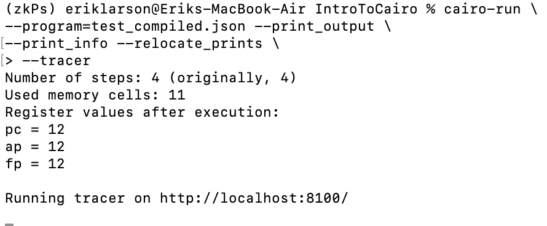
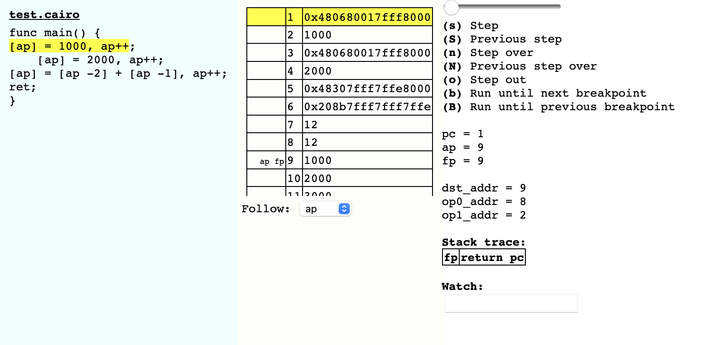

# IntroToCairo

## Setting up the Cairo Environment:
The following instructions can be found in the <a href="https://docs.starknet.io/documentation/getting_started/setting_up_the_environment/">StarkNet Documentation</a>.

### Step 1:

As always when developing you should work within a controlled virtual environment.  You can create and activate / enter into a Python Virtual Environment with the following command:
~~~
python3.9 -m venv ~/cairo_venv
source ~/cairo_venv/bin/activate
~~~

NOTE: As of this publication, the StarkNet docs suggest you use python 3.9 while setting up your environment.  If you choose not too, then you'll need to follow an additional step to install another package.

### Step 2:

Make sure that your new environment is activated.  Then proceed to install the following packages: ecdsa, fastecdsa, sympy (using pip3 install ecdsa fastecdsa sympy)

On Ubuntu, use the following command: 

~~~
sudo apt install -y libgmp3-dev
~~~

On Mac, you can use brew:

~~~
brew install gmp
~~~

On Windows.., don't use windows. 

There isn't support for windows.  I would suggest creating a Virtual Machine and installing Ubuntu if you have a Windows Machine.

### Step 3:
Install the cairo-lang Python package with, 
~~~
pip3 install cairo-lang
~~~

### Step 4: (if you have an earlier verison than Python 3.9 installed)
Cairo was tested with python 3.9.  To make it work with earlier versions you will need to install contextvars:
~~~
pip3 install contextvars
~~~

### Additional info:
If you don't know what packages you have and need to check you can run the following code within your Python Virtual Environment:
~~~
pip list
~~~

## Compiling and running a Cairo program:
### Step 1:  Create and test a Cairo function.
Create a file, named test.cairo, with the following lines of code:
~~~
func main() {
[ap] = 1000, ap++;
    [ap] = 2000, ap++;
[ap] = [ap -2] + [ap -1], ap++;
ret;
}
~~~

### Step 2:  Compile
#### (make sure all commands are executed in the virtual environment)
~~~
cairo-compile test.cairo --output test_compiled.json
~~~

The command, "cairo-compile", is telling the Cairo system to compile the file you just created, "test.cairo".
"--ouput test_compiled.json" will generate a new json file to the directory you are in named, "test_compiled.json".

### Step 3: Run your program
Running the following command:
~~~
cairo-run \
--program=test_compiled.json --print_output \
--print_info --relocate_prints
~~~

Should result in the following output within your terminal:

### Step 4: Open the Cairo Tracer
You can open the Cairo tracer by providing the --tracer flag to the cairo-run command we did in Step 3.  Then you can open it at http://localhost:8100/ .

Open you localhost link to see the following details in your browser:

